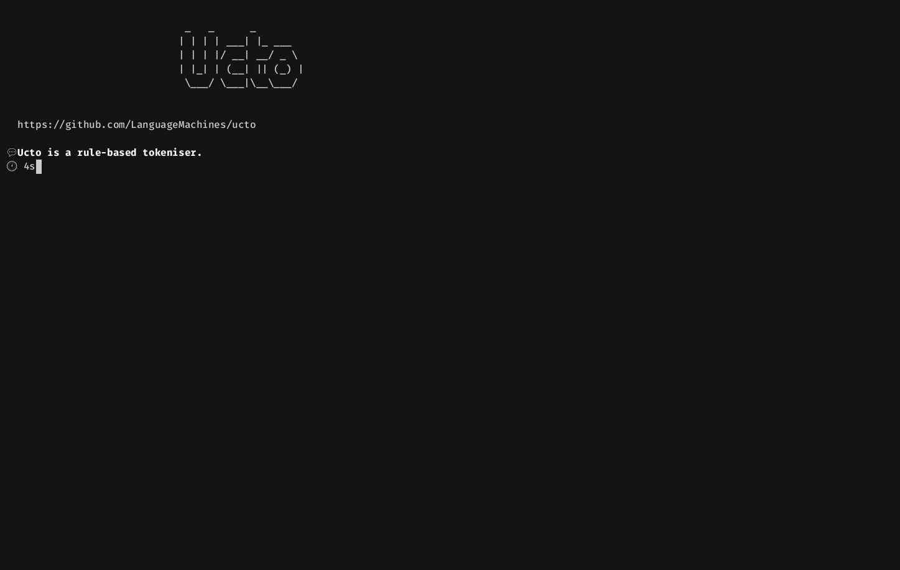
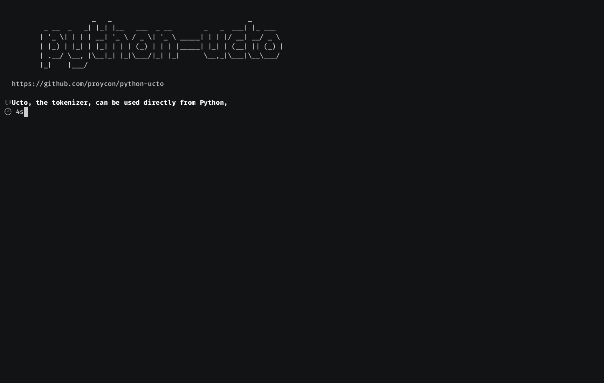

# CLARIAH WP3 Demos

This repository contains some screencast demos for a subset of software
developed in CLARIAH WP3. Furthermore it contains the sources to generate these
screencasts.

## Demos

### Frog


### Python-frog


### Ucto



### Python-ucto



### Colibri Core


### Analiticcl


## Play

Rather than look at prepared gifs, you can play these directly in your terminal
if you have [asciinema](https://asciineme.org) installed. This typically
provides better quality. Clone this repository and do for example:

```
$ asciinema play frog.cast
```

A small `play.sh` script is included in this repository that plays all demos in a loop:

```
$ ./play.sh
```

## Build

You can build all demos from source yourself as follows:

```
$ cd src/
$ docker build -t wp3-demos .
$ docker run --rm -i -t -v .:/data/ wp3-demos
```

For only a single demo, just pass something like `frog.cast` or `frog.gif`:

```
$ docker run --rm -i -t -v .:/data/ wp3-demos
```

For a video of all demos combined:

```
$ docker run --rm -i -t -v .:/data/ wp3-demos demo.mkv
```
